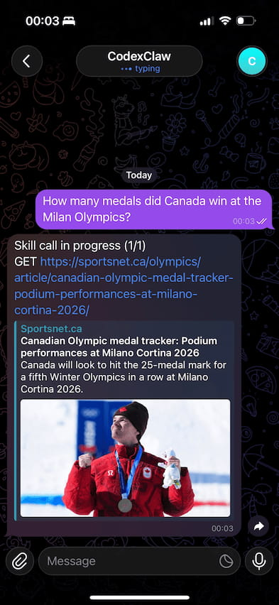
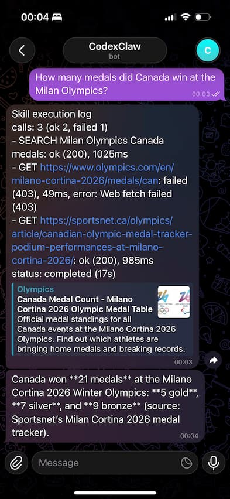
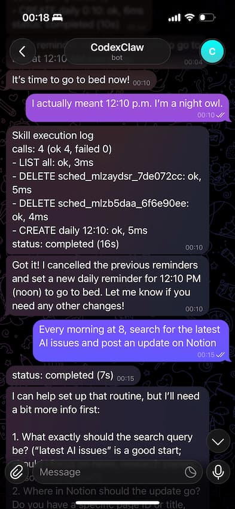
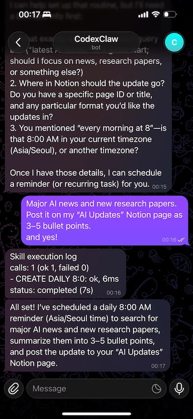

# codexclaw

[English](../README.md) | [한국어](README.ko.md) | [日本語](README.ja.md)

이 코드의 대부분은 GPT-5.3-Codex-xhigh로 작성되었고, 그래서 Codex와 함께 계속 수정하고 발전시킬 수 있습니다.  
이 프로젝트는 Codex/Qwen/Ollama/OpenRouter + Telegram 연동에 집중합니다.  
이 프로젝트는 훨씬 큰 OpenClaw 프로젝트에서 제가 필요한 부분만 추출해서 만들었습니다.  
OpenClaw는 MIT 라이선스([openclaw/openclaw](https://github.com/openclaw/openclaw))로 배포되며, 이 프로젝트도 동일합니다.

최소한의 온보딩 + 런타임 구성:

1. provider 선택(OpenAI Codex, Qwen, Ollama, OpenRouter)
2. provider별 모델 선택
3. Telegram 봇 브리지
4. 선택: Notion 스킬 API 키 설정
5. 선택: 웹 도구(`web_search`, `web_fetch`) 설정
6. 선택: 스케줄러 도구(`schedule_create`, `schedule_list`, `schedule_delete`) 설정
7. 워크스페이스 파일 스킬(`workspace_files`)로 메모리/지시 파일 관리

<table>
  <tr>
    <td align="center" width="50%">
      <a href="images/telegram-chat-01.jpg">
        
      </a>
    </td>
    <td align="center" width="50%">
      <a href="images/telegram-chat-02.jpg">
        
      </a>
    </td>
  </tr>
  <tr>
    <td align="center" width="50%">
      <a href="images/telegram-chat-03.jpg">
        
      </a>
    </td>
    <td align="center" width="50%">
      <a href="images/telegram-chat-04.jpg">
        
      </a>
    </td>
  </tr>
</table>

## 설치

```bash
git clone https://github.com/jong-choi/codexclaw.git
cd codexclaw
npm install
```

## Docker

프로젝트 루트에서 CodexClaw 스택 실행(`codexclaw_shared` 네트워크 자동 생성):

```bash
docker compose up --build -d
```

별도 폴더에서 Ollama 스택 실행:

```bash
cd deploy/ollama
docker compose up -d
```

온보딩 또는 `/provider ollama`에서 주소 입력 시 기준:

- 같은 Docker 네트워크(`codexclaw_shared`): `http://ollama:11434`
- Ollama가 호스트 머신에서 실행 중: `http://127.0.0.1:11434` (컨테이너에서는 `http://host.docker.internal:11434` 가능)
- 다른 서버에서 실행 중: 컨테이너에서 접근 가능한 `http(s)://<host>:<port>`

Ollama 컨테이너에서 모델 pull/list:

```bash
cd deploy/ollama
docker compose exec ollama ollama pull gpt-oss:20b
docker compose exec ollama ollama list
```

스택 종료:

```bash
# 모드 A (레포 루트에서 실행)
docker compose down

# Ollama 스택 (deploy/ollama에서 실행)
cd deploy/ollama
docker compose down
```

온보딩 실행(대화형 provider 설정: Codex/Qwen은 OAuth, Ollama는 endpoint 입력, OpenRouter는 API 키 + 무료 모델 스캔):

```bash
# 레포 루트에서 실행
docker compose run --rm codexclaw onboard
```

Docker로 Telegram 봇 실행(대화형, 페어링 코드 입력용 권장):

```bash
# 레포 루트에서 실행
docker compose run --rm codexclaw telegram run
```

이 대화형 터미널에서 `bye` 또는 `exit`를 입력하면 봇 프로세스를 중지하고 셸로 돌아옵니다(`\`/bye\``, `\`/exit\``도 동작).

권장 흐름:
- 첫 실행: `--rm` 대화형 모드로 터미널에서 페어링 코드를 승인
- 페어링 완료 후: 분리 모드(`-d`)로 실행해 서버에서 계속 동작

분리 모드로 Telegram 봇 실행:

```bash
docker compose run -d --name codexclaw-telegram codexclaw telegram run
docker logs -f codexclaw-telegram
```

분리 모드 봇 중지:

```bash
docker stop codexclaw-telegram
docker rm codexclaw-telegram
```

중요:
- 하나의 토큰에는 Telegram polling 인스턴스를 하나만 실행하세요.
- 다른 봇 인스턴스가 이미 실행 중이면 `docker compose run --rm codexclaw telegram run`을 실행하지 마세요.

마스킹된 설정 보기:

```bash
docker compose run --rm codexclaw config show
```

정리 스크립트(대화형):

```bash
./scripts/uninstall.sh
```

워크스페이스 초기화 스크립트:

```bash
./scripts/reset-workspace.sh
```

이 스크립트는 워크스페이스 디렉터리만 초기화하고 `MEMORY.md` / `INSTRUCTIONS.md`를 다시 생성합니다.  
현재 워크스페이스를 삭제한 뒤 `.codexclaw/initial-workspace` 내용을 복사하고, 마지막에 `MEMORY.md`, `INSTRUCTIONS.md`를 보장합니다.

스크립트는 먼저 리소스 존재 여부를 확인하고, 항목별로 물어봅니다:
- 실행 중인 프로젝트 컨테이너 -> `docker compose down` 실행 여부
- 프로젝트 이미지 -> 이미지 삭제 여부
- 프로젝트 볼륨 -> 볼륨 삭제 여부
- 워크스페이스 파일(`.codexclaw/workspace`) -> 워크스페이스 파일 초기화 여부
- 전역 설정(`~/.codexclaw`) -> 전역 설정 삭제 여부

참고:
- 어떤 카테고리에 리소스가 없으면 해당 질문은 건너뜁니다.
- 프로젝트 소스 파일은 절대 삭제하지 않습니다.

## 온보딩

```bash
npm run onboard
```

Provider 설정 방식은 provider에 따라 다릅니다:
- OpenAI Codex: 콜백 URL 수동 붙여넣기
- Qwen: device-code 로그인(URL 열기 + 승인 + 자동 폴링)
- Ollama: base URL 입력 후 감지된 모델 목록에서 선택 (`같은 Docker 네트워크면 http://ollama:11434`)
  - 아직 pull한 모델이 없어도 온보딩은 계속 진행할 수 있습니다.
  - 이후 Telegram에서 `/ollama pull gpt-oss:20b` -> `/models` -> `/model <id|번호>` 순서로 설정하세요.
- OpenRouter: API 키 + base URL(기본값 `https://openrouter.ai/api/v1`) 입력 후 무료 모델을 동적으로 스캔/선택
  - 무료 모델 판정(OpenClaw 기준): 모델 ID가 `:free`로 끝나거나 prompt/completion 가격이 0.

기본적으로 설정은 `~/.codexclaw/config.json`에 저장됩니다.  
Telegram 접근은 기본적으로 openclaw 스타일 페어링(`dmPolicy: "pairing"`)을 따릅니다:
- Telegram에서 봇에게 DM 전송
- 봇이 페어링 코드 응답
- 실행 중인 `npm run telegram` 터미널에 코드를 입력하고 Enter
- 빈 줄은 "코드 없음"(무시)
- 실행 중인 봇 터미널에 `bye` 또는 `exit` 입력 시 중지(`\`/bye\``, `\`/exit\``도 동작)

대화 기록은 `~/.codexclaw/telegram-conversations.json`에 저장됩니다.

Notion (선택):
- 온보딩 중 `notion` 스킬을 활성화하고 Notion integration token을 저장할 수 있습니다.
- 토큰 저장 위치: `skills.entries.notion.apiKey`
- 설정되면 어시스턴트가 내장 `notion_api_request` 도구로 Notion REST 호출을 수행할 수 있습니다.

웹 도구 (선택):
- 온보딩 중 `web_search`, `web_fetch` 스킬을 활성화할 수 있습니다.
- `web_search`는 Brave Search API(`skills.entries.web_search.apiKey` 또는 `BRAVE_API_KEY`)를 사용합니다.
- `web_fetch`는 웹 페이지의 읽기 가능한 본문을 가져옵니다(API 키 불필요).

스케줄러 (선택):
- 온보딩 중 `scheduler` 스킬을 활성화할 수 있습니다.
- `schedule_create`: 지연 기반 또는 절대 시간 기반 스케줄 등록
- `schedule_list`: 현재 등록된 작업 조회
- `schedule_delete`: 단일 작업 취소
- `schedule_recurring_create`: 반복 리마인더 등록(`daily`/`weekly`)
- `schedule_recurring_list`: 등록된 반복 리마인더 조회
- `schedule_recurring_delete`: 반복 리마인더 취소
- `schedule_recurring_pause`: 반복 리마인더 일시중지
- `schedule_recurring_resume`: 일시중지된 반복 리마인더 재개
- 채팅 타임존 도구: `timezone_get`, `timezone_set`, `current_time_get`
- 타임존은 온보딩이 아니라 Telegram 채팅 중(`timezone_set`) 설정합니다.
- `schedule_create.prompt`와 `schedule_recurring_create.prompt`는 원문 예약 문장이 아니라 미래 시점 지시문이어야 합니다.
  예: `Schedule a reminder for 8 AM tomorrow to call my mom` -> `Tell the user to call their mom now.`
- 스케줄 작업은 채팅 단위로 동작하며, 시간이 되면 새로운 Codex 실행을 트리거합니다.

워크스페이스 파일 (항상 사용 가능):
- CodexClaw는 워크스페이스 도구 `workspace_read_file`, `workspace_write_file`, `workspace_delete_path`를 제공합니다.
- 기본 워크스페이스 루트: `./.codexclaw/workspace`(실행 디렉터리 기준)
- 기본 워크스페이스 템플릿: `./.codexclaw/initial-workspace`
- `.codexclaw/workspace`는 기본적으로 gitignore 처리됩니다.
- 선택 설정: config의 `workspace.root`로 경로 변경 가능
- 온보딩 시 워크스페이스가 비어 있으면 템플릿 파일을 복사합니다.
- 온보딩 시 워크스페이스가 이미 비어 있지 않으면 템플릿으로 초기화할지 묻습니다.
- 각 세션 첫 턴에서 시스템 프롬프트가 Codex에게 `MEMORY.md`, `INSTRUCTIONS.md` 확인을 지시합니다.
- 파일이 없으면 런타임 초기화 단계에서 자동 생성됩니다.

## Telegram 봇 실행

```bash
npm run telegram
```

런타임 동작:
- 채팅/세션별 멀티턴 컨텍스트 유지
- `/help` (`/commands`도 가능): 커맨드 목록과 사용 예시 출력
- `/new`, `/clear`, `/reset`: 현재 채팅의 저장된 컨텍스트 초기화
- `/context`: 저장된 컨텍스트 메시지 수 확인
- `/usage`: 실시간 한도 윈도우 확인(Codex provider에서만 지원)
- `/think`, `/thinking`, `/reasoning`: 리즈닝 에포트 조회/변경(`none|minimal|low|medium|high|xhigh`)
- `/provider`: 현재 provider/모델과 진행 중인 provider 설정 상태 확인
- `/provider <id|alias|번호>`: provider 전환(Codex/Qwen은 OAuth, Ollama는 endpoint 입력 안내, OpenRouter는 API 키 입력 + 무료 모델 스캔)
- `/provider cancel`: 진행 중인 provider 설정 취소
- `/models`: 현재 provider에서 사용 가능한 모델 목록 확인
- `/model`: 현재 provider/모델 + 리즈닝 에포트 + 한도 요약 확인, `/model <id|번호>`로 즉시 모델 변경
- `/ollama list|pull|rm`: Ollama 모델 목록/추가/삭제
- Codex OAuth 진행 중에는 다음 일반 메시지를 콜백 URL 입력으로 처리
- Ollama 설정 진행 중에는 다음 일반 메시지를 Ollama base URL 입력으로 처리
- OpenRouter 설정 진행 중에는 다음 일반 메시지를 OpenRouter API 키 입력으로 처리
- 잘못된 커맨드/인자 입력 시: 올바른 사용법과 `/help` 안내를 반환
- 터미널 입력 `bye` 또는 `exit`: `telegram run` 즉시 종료(`\`/bye\``, `\`/exit\``도 동작)
- Telegram 명령어 메뉴(`/`)는 시작 시 자동 동기화됩니다.
- 현재 UTC/로컬 시간 컨텍스트가 모든 모델 요청에 주입됩니다.
- 도래한 스케줄 작업은 별도 입력 없이 같은 봇 프로세스에서 실행됩니다.
- 사용자 요청 수신 직후 봇이 상태 메시지를 능동적으로 게시합니다.
- 처리 중에는 주기적으로, 그리고 스킬/도구 호출 시 상태를 업데이트합니다.
- 완료/실패 상태를 최종 게시하고, 도구 사용 시 스킬 실행 로그도 함께 게시합니다.

### Telegram 상태 업데이트 기능

CodexClaw는 상태 전달을 프롬프트 문구가 아닌 런타임 기능으로 처리합니다:
- 사용자 요청을 받는 즉시 상태 메시지 생성
- 처리 중 동일 메시지를 인플레이스 수정(`status: processing (Xs)`)
- 도구 라이프사이클(start/result, method/path, success/failure) 반영
- `status: completed` 또는 `status: failed`로 마무리
- 도구 사용 시 간결한 `Skill execution log` 추가

타이밍:
- 주기적 작업 상태 갱신 간격: `10s`
- 도구 이벤트 직후 quiet window: `8s`

언어 동작:
- 사용자 입력이 한국어이면 한국어 상태 텍스트
- 그 외에는 영어 상태 텍스트

선택 설정:
- `telegram.proactiveStatus`를 `false`로 설정하면 능동 상태 메시지를 비활성화합니다.

## 설정 보기(마스킹)

```bash
npm run config
```

## 선택: 사용자 지정 설정 경로

```bash
node ./bin/codexclaw.mjs onboard --config /tmp/codexclaw.json
node ./bin/codexclaw.mjs telegram run --config /tmp/codexclaw.json
```
